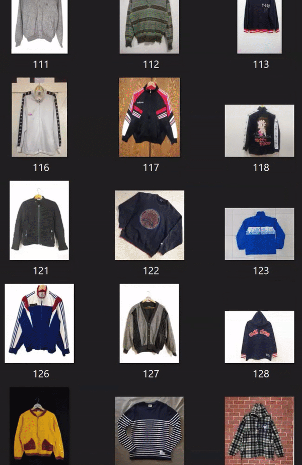

# Grailed Image Scraper

<p align="center">
    
</p>


Scrape images from listings on Grailed.com.
Here's an [example image dataset of six thousand images](https://github.com/KwhoaKai/KwhoaKai.github.io/blob/master/6k-Sweaters.zip) scraped from the search term "vintage sweaters".

## Required:  
[Selenium](https://selenium-python.readthedocs.io/installation.html): Python framework for web testing.  
[chromedriver](https://chromedriver.chromium.org/downloads): Used for web automation and scrolling.  
[pandas](https://pandas.pydata.org/pandas-docs/stable/install.html): Store listing metadata in dataframe and send to CSV.  

## Why?
I needed a large set of images to serve as training data for ML projects. However, Grailed doesn't have a public API (as of Dec. 2019) and existing Grailed scrapers retrieve listing data, but not images.

## Features 
- [x] Scrape images
- [x] Save listing designers to CSV
- [x] Resizable images
- [ ] Efficient enough to save over 6k images in reasonable time


## How do I use this?
The script works by entering a query into the search bar on the home page of Grailed, then scrolling down until the target number of images is reached. The search argument is required. Make sure to quote your query if it contains a space, ex: "vintage sweater".

Though Grailed's api isn't public, we can still change the parameters in the url to download the images at whatever dimensions we want! 
Arguments for image width and image height are optional. If one dimension is specified, the other dimension will be whatever is required to maintain the aspect ratio. Otherwise, both arguments are used. Be aware, the image may be cropped to whatever size you specifiy. If neither dimension is specified, width is set to 200 and height is set to maintain image ratio.

Finally, there is an optional argument specifying the target number of images to download, with the default set to 1000.

Optional arguments:
```
--num, -n: # Number of images to scrape
--width, -w: # Set image width, defaults to 200
--height, -he: # Set image height
```

Search for "vintage sweater" and download 500 listing photos with a width of 100px
```
python grailed_scraper.py "vintage sweater" --num 500 --width 100
```

Chromedriver can be buggy sometimes. If it isn't scrolling, try running the script again.


## Todo 
- General optimizations to increase efficiency (Better way to track previously visited listings)
- Find optimal scroll length for lazy loading, this value is currently hardcoded

### Disclaimer
The acceptable use policy for Grailed.com [doesn't officially allow for web scrapers.](https://www.grailed.com/acceptable) Please use at your own discretion, for non-nefarious purposes. Thanks!

